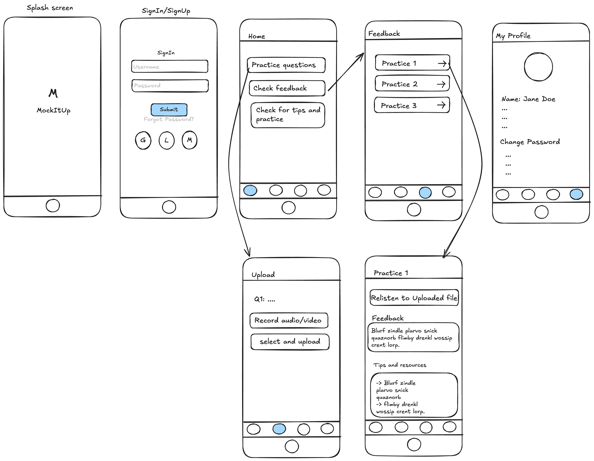

# **MockItUp**

Proposed by: _Sushma Manthena_

## **Summary**

MockItUp is an iOS app designed to revolutionize interview preparation by enhancing users' communication skills. Many individuals face challenges in expressing confidence and clarity during interviews. MockItUp analyzes voice and video recordings, offering actionable insights on key factors such as confidence, grammar, and accuracy. Powered by machine learning, it provides real-time feedback, enabling candidates to practice more effectively and improve their interview readiness. Additionally, it offers users valuable resources for targeted practice, making it an essential tool in today's competitive job market.

### **Value Proposition**

MockItUp addresses the challenge of improving communication skills, which are crucial for successful interviews.

Pain Points:

- Many candidates find it difficult to convey with confidence and clarity during interviews, even when they possess strong technical skills.
- Most interview preparation tools lack real-time, personalized feedback and proper guidance with practice resources, making it challenging for users to identify and address areas needing improvement.

Hence, this app helps users who need assistance improving their verbal communication, non-verbal cues, and confidence during interviews. Research shows that soft skills, such as communication, are also one of the deciding factors for hiring decisions especially for the tech roles.

### **Primary Purpose**

The primary purpose of MockItUp is to help candidates enhance their communication skills through personalized feedback and guided resources, powered by machine learning analysis of their interview performances. The app seeks to make interview preparation more accessible, effective, and tailored to each user's unique strengths and weaknesses. By providing targeted insights and practice, MockItUp increases users' chances of securing jobs and excelling in real-world interview scenarios.

### **Target Audience**

- Recent college graduates and job seekers preparing for their first or next job interviews.
- Professionals in transition looking to improve their interviewing skills.
- Individuals preparing for industry-specific interviews where communication is key, such as consulting or management roles.

Communication skills often make or break a candidate's success in interviews. The target audience includes people who are likely to face high-stakes in interviews and would benefit from feedback on their communication and language.

### **Success Criteria**

The primary metric will be user feedback and engagement metrics (e.g., how many sessions are completed, frequency of use, and qualitative feedback on the utility of the feedback given). And we can also measure success through case studies of users reporting that the app helped them succeed in their interviews.

### **Competitor Analysis**

Apps like Pramp and Voomer analyze communication skills by assessing confidence, but a unique feature of MockItUp is the ability to provide real-time feedback during the mock interview. Additionally, it offers emotion and tone analysis, ensuring users understand how their delivery affects their performance. MockItUp also focuses on asking the right questions tailored to the user’s specific career goals, enhancing the overall interview preparation experience.

### **Monetization Model**

Offer a free tier with basic mock interviews and feedback. Users can upgrade to a premium subscription for advanced features like detailed emotion analysis, real-time question adjustment, peer reviews, and personalized feedback reports.

### **Initial Design**

The Minimum Viable Product (MVP) will include:

- Basic mock interview setup where users can answer predefined questions via voice.
- Using machine learning algorithms that analyze grammar, confidence, and accuracy, with basic feedback provided.
- Simple user interface for recording, reviewing, and receiving feedback on their answers.

Scope:

- The MVP will focus on job seekers and interview preparation, without delving into niche interview formats.
- Limitations include only focusing on verbal communication in the first version, while non-verbal communication (e.g., body language) and providing resources for preparation will be added in future versions.

### **UI/UX Design**

Few screens that would be included in MVP:

- SignIn/ SignUp screens
- Home screen: Here we show all the available options, i.e upload a file, record an audio/video, check feedback for already uploaded practice question, check tips for further practice.
- Practice screen: In the practice questions, we will have an option to upload a file/record.
- Feedback screen: Analysis and feedback and if possible tips
- Profile Page: Password and other profile options.

Additional Screens(May or may not be part of MVP based on bandwidth):

- Add graphical representation of the practice and feedback for understanding the progress.

Sample screens:

### **Technical Architecture**

- Storage Considerations: Store audio/video files in some cloud to have access across any device.
- Cloud Integrations: Use some storage for files. May be AWS/firebase.
- Machine Learning: Leverage pre-trained models for speech recognition, sentiment analysis, and body language evaluation (e.g., Apple's Core ML or PyTorch or TensorFlow).
- Success metrics would be based on how fast ML evaluates the results and gives feedback to users.

## **Challenges and Open Questions**

Technical Challenges:

- Data Processing: Handling large volumes of audio and video data in real time could lead to performance bottlenecks. One of the solution could be using some cloud data store and optimised techniques to store that data.
- Hardware limitations: Noise identifications in older iPhones.
- Accuracy of AI Feedback: Ensuring that the machine learning models provide reliable and meaningful feedback, particularly in non-verbal communication (e.g., tone, confidence). Solution: Regularly re-training the model based on user feedback.

Open Questions:

- Where to get the dataset to train the models?
- Should it be particular to only interviews or can be extended to other as well?
